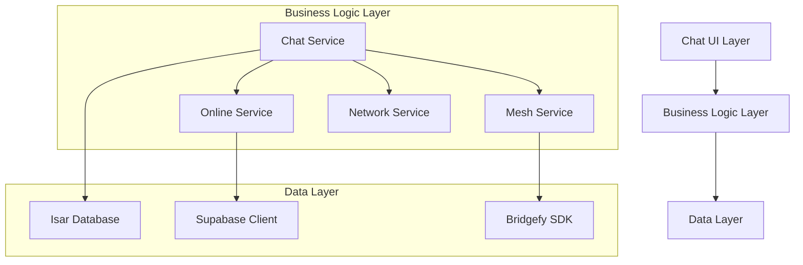

# Design Document

## Overview

The Hybrid Chat App is a Flutter-based messaging application that seamlessly operates in both online and offline modes. The application uses a layered architecture with clear separation between UI, business logic, and data persistence layers. The core innovation lies in its ability to automatically switch between Supabase-based online messaging and Bridgefy-powered mesh networking for offline communication, while maintaining a unified user experience.

## Architecture

### High-Level Architecture



### Service Architecture

The application follows a service-oriented architecture with the following key services:

1. **ChatService**: Central orchestrator that manages message flow and mode switching
2. **MeshService**: Handles offline mesh networking using Bridgefy
3. **OnlineService**: Manages online communication via Supabase
4. **NetworkService**: Monitors connectivity and triggers mode switches
5. **DatabaseService**: Manages local message persistence with Isar

## Components and Interfaces

### Core Components

#### 1. Message Model
```dart
@collection
class Message {
  Id id = Isar.autoIncrement;
  late String text;
  late String senderId;
  late DateTime timestamp;
  late bool isOffline;
  late String status; // 'sent', 'delivered', 'pending'
  String? conversationId;
}
```

#### 2. ChatService Interface
```dart
abstract class IChatService {
  Stream<List<Message>> get messagesStream;
  Future<void> sendMessage(String text);
  Future<void> switchMode(bool isOfflineMode);
  bool get isOfflineMode;
}
```

#### 3. MeshService Interface
```dart
abstract class IMeshService {
  Future<void> initialize(String apiKey);
  Future<void> start();
  Future<void> stop();
  Future<void> sendMeshMessage(String text, String senderId);
  Stream<Message> get incomingMessages;
}
```

#### 4. OnlineService Interface
```dart
abstract class IOnlineService {
  Future<void> initialize();
  Future<void> sendOnlineMessage(String text, String senderId);
  Stream<Message> get incomingMessages;
  Future<void> syncOfflineMessages(List<Message> messages);
}
```

### UI Components

#### 1. ChatScreen
- Main chat interface with message list
- Input field with send button
- Mode toggle switch (Online/Offline)
- Connection status indicator

#### 2. MessageBubble
- Individual message display component
- Shows message text, timestamp, and status
- Visual distinction for online vs offline messages
- Status indicators (sent, delivered, pending)

#### 3. ChatInput
- Text input field
- Send button
- Mode toggle switch
- Character counter (optional)

## Data Models

### Message Storage Schema

The Isar database will store messages with the following schema:

```dart
@collection
class Message {
  Id id = Isar.autoIncrement;
  
  @Index()
  late String text;
  
  @Index()
  late String senderId;
  
  @Index()
  late DateTime timestamp;
  
  late bool isOffline;
  
  @Enumerated(EnumType.name)
  late MessageStatus status;
  
  String? conversationId;
  String? messageHash; // For deduplication
}

enum MessageStatus {
  pending,
  sent,
  delivered,
  failed
}
```

### Network State Management

```dart
enum NetworkMode {
  online,
  offline,
  auto
}

class NetworkState {
  final NetworkMode mode;
  final bool hasInternetConnection;
  final int connectedPeers;
  final DateTime lastSync;
  
  const NetworkState({
    required this.mode,
    required this.hasInternetConnection,
    required this.connectedPeers,
    required this.lastSync,
  });
}
```

## Error Handling

### Error Categories

1. **Network Errors**
   - Internet connectivity loss
   - Mesh network initialization failure
   - Peer connection timeouts

2. **Database Errors**
   - Isar initialization failure
   - Message persistence errors
   - Synchronization conflicts

3. **Service Errors**
   - Bridgefy SDK errors
   - Supabase connection errors
   - Authentication failures

### Error Handling Strategy

```dart
class ChatError {
  final String code;
  final String message;
  final ErrorSeverity severity;
  final DateTime timestamp;
  
  const ChatError({
    required this.code,
    required this.message,
    required this.severity,
    required this.timestamp,
  });
}

enum ErrorSeverity {
  info,
  warning,
  error,
  critical
}
```

### Recovery Mechanisms

1. **Automatic Retry**: Failed messages are automatically retried with exponential backoff
2. **Graceful Degradation**: App continues to function with reduced capabilities when services fail
3. **User Notification**: Critical errors are communicated to users with actionable suggestions
4. **Offline Queue**: Messages are queued locally when transmission fails

## Testing Strategy

### Unit Testing

1. **Service Layer Testing**
   - Mock external dependencies (Bridgefy, Supabase)
   - Test message routing logic
   - Validate error handling scenarios

2. **Model Testing**
   - Message serialization/deserialization
   - Database schema validation
   - Data integrity checks

### Integration Testing

1. **Database Integration**
   - Isar database operations
   - Message persistence and retrieval
   - Schema migration testing

2. **Network Integration**
   - Connectivity monitoring
   - Mode switching logic
   - Synchronization processes

### Widget Testing

1. **UI Component Testing**
   - ChatScreen rendering
   - Message bubble display
   - Input field functionality

2. **User Interaction Testing**
   - Send message flow
   - Mode toggle behavior
   - Error state handling

### End-to-End Testing

1. **Offline Scenario Testing**
   - Mesh network message transmission
   - Multi-hop message relay
   - Peer discovery and connection

2. **Online Scenario Testing**
   - Real-time message synchronization
   - Conflict resolution
   - Cross-device consistency

3. **Hybrid Scenario Testing**
   - Mode switching during active conversations
   - Message queue processing
   - Synchronization after connectivity restoration

## Implementation Considerations

### Performance Optimizations

1. **Message Pagination**: Implement lazy loading for large conversation histories
2. **Database Indexing**: Optimize Isar queries with appropriate indexes
3. **Memory Management**: Efficient handling of message streams and listeners

### Security Considerations

1. **Message Encryption**: Implement end-to-end encryption for sensitive communications
2. **Peer Authentication**: Validate peer identity in mesh networks
3. **Data Sanitization**: Prevent injection attacks through message content

### Scalability Factors

1. **Mesh Network Limits**: Handle Bridgefy's peer connection limitations
2. **Database Growth**: Implement message archiving and cleanup strategies
3. **Synchronization Efficiency**: Optimize bulk message synchronization

### Platform Considerations

1. **Android Permissions**: Handle Bluetooth and location permissions for mesh networking
2. **iOS Background Processing**: Manage app lifecycle for continuous mesh operation
3. **Battery Optimization**: Minimize power consumption during mesh operations